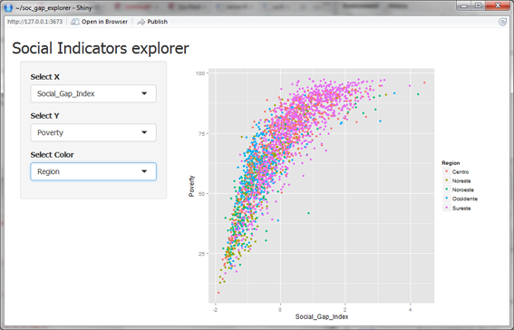
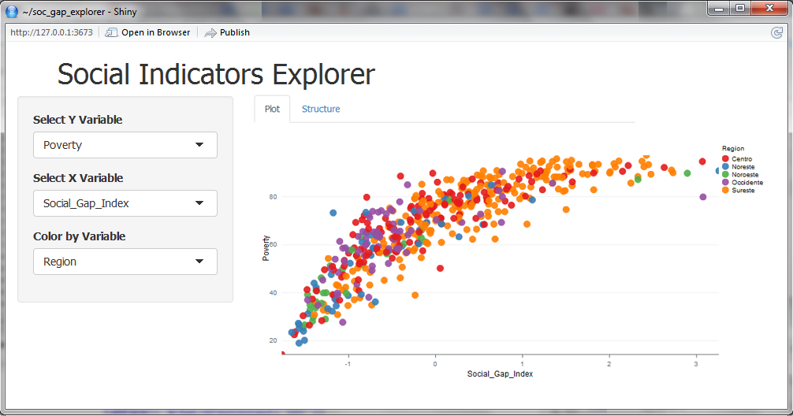

# Shiny_app  
I'm having real trouble to upload the app to the shinyio site, in my first try I designed an app using rCharts but the deploying  failed, in the second try I did the same app using ggplot2 instead, but I can't manage to deploy the data to the shinyio site.  
## The code files  
Nevertheless I can share the code files anda data.  
In the folder app_rChart you can find the code for the first try. 
The app may look like this: 
 
In the folder sie_ggplot2 you can find the code for the second one. 
 
